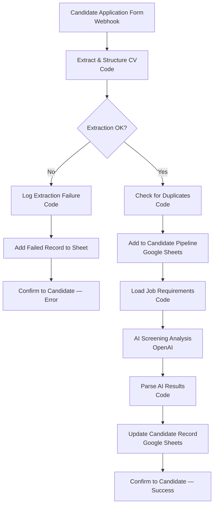

# CV Screening Automation — UK Recruitment

An n8n workflow that automates first-pass candidate screening: intake, CV parsing, deduplication, AI-assisted evaluation against job requirements, and pipeline tracking — with an explicit error path for CVs that fail to parse, instead of dropping them silently.

**[Watch the walkthrough →](https://youtu.be/3yUpuBxZmGA)**

## How it works

## Pipeline steps

| # | Node | Type | Purpose |
|---|------|------|---------|
| 1 | Candidate Application Form | Webhook | Receives a candidate submission |
| 2 | Extract & Structure CV | Code | Parses the raw submission into structured fields |
| 3 | Extraction OK? | IF | Branches on whether parsing succeeded |
| 4 | Check for Duplicates | Code | Prevents the same candidate being processed twice |
| 5 | Add to Candidate Pipeline | Google Sheets | Logs the candidate into the tracking sheet |
| 6 | Load Job Requirements | Code | Pulls in the criteria to screen against |
| 7 | AI Screening Analysis | OpenAI | Evaluates the candidate against job requirements |
| 8 | Parse AI Results | Code | Structures the AI's evaluation output |
| 9 | Update Candidate Record | Google Sheets | Writes the evaluation back to the pipeline |
| 10 | Log Extraction Failure → Add Failed Record | Code + Google Sheets | Error path for failed parses — logged, not dropped |
| 11 | Confirm to Candidate (success / error) | Respond to Webhook | Sends a response back on either path |

## Stack

n8n • Webhooks • OpenAI • Google Sheets

## Design notes — what this is, and what it isn't

This is a single-workflow demonstration of an AI-assisted screening pipeline: structured extraction from unstructured input, deduplication, AI-driven evaluation, and — the part most versions of this pattern skip — an explicit failure branch instead of silent drops.

It is not a production hiring system, and I wouldn't represent it as one. Three specific things I'd change before letting it run unsupervised on real candidates:

- **Add a human-approval gate** before an AI verdict changes a candidate's status. Right now the AI's evaluation writes straight to the pipeline record with no review step.
- **Move off Google Sheets** to a real datastore. Sheets works for a demo; it doesn't hold up under concurrent writes or handle candidate PII the way a proper database with access controls would.
- **Add input validation and rate limiting** on the public intake webhook, and swap the custom-code CV extraction for a real document-parsing library so it holds up against messy real-world input, not just the clean case.

## Run it yourself

1. Import `cv_screening_n8n_workflow.json` into n8n
2. Set your Google Sheet ID in the Google Sheets nodes
3. Add your OpenAI credential
4. Activate the workflow and POST a candidate submission to the webhook URL
