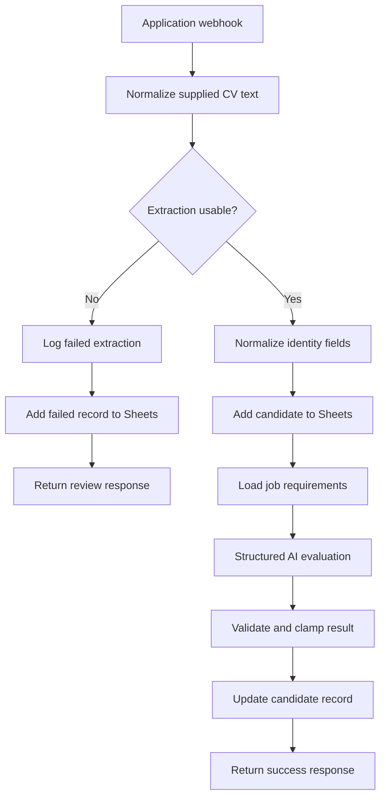

# CV Screening Automation — UK Recruitment


An n8n portfolio workflow for first-pass candidate screening. It accepts a candidate submission, structures supplied CV text, routes extraction failures, records the candidate in Google Sheets, evaluates the submission against explicit job requirements, validates the AI response, and returns a clear webhook response.

**[Open the visual project page →](./index.html)**  
**[Watch the recorded walkthrough →](https://youtu.be/3yUpuBxZmGA)**

## Evidence-backed scope

The included export contains **13 n8n nodes** and two explicit completion paths:

1. Webhook intake
2. Candidate-data normalization
3. Extraction quality check
4. Candidate record creation in Google Sheets
5. Job-requirement lookup
6. Structured OpenAI screening analysis
7. AI-output parsing and score validation
8. Candidate record update
9. Success response
10. Failure logging, failed-record creation, and error response

The workflow export contains no credential objects, API keys, personal candidate records, or private source documents. Google Sheet identifiers are placeholders.

## Architecture



## What is implemented

| Capability | Evidence in the export |
|---|---|
| Candidate intake | POST webhook with response handled by dedicated response nodes |
| Structured candidate record | Code node normalizes form fields and supplied CV text |
| Extraction failure path | Low-confidence input branches to failure logging and a separate response |
| Pipeline persistence | Google Sheets append and update nodes |
| Requirement-based scoring | Explicit role requirements are passed to an OpenAI evaluation node |
| Structured AI output | JSON-only prompt plus parsing, normalization, and 0–100 score clamping |
| Safer evaluation prompt | Prompt explicitly excludes protected characteristics from scoring |

## Important limitations

This is a working portfolio demonstration, not a production hiring system.

- CV binary parsing is not included. The workflow expects supplied `cv_text`; missing or very short text is routed for review.
- The duplicate-check node normalizes email, but its datastore lookup is still a documented placeholder and currently resolves `isDuplicate` to `false`.
- AI output writes directly to the tracking sheet. A human approval gate should be added before an evaluation changes candidate status.
- Google Sheets is suitable for a demonstration, not for sensitive candidate data at production scale.
- A public deployment would need stronger input validation, authentication, rate limiting, retention controls, audit logging, and access control.

## Run it

1. Import `workflow/cv_screening_n8n_workflow.json` into n8n.
2. Replace `YOUR_GOOGLE_SHEET_ID` in the Google Sheets nodes.
3. Attach your own Google Sheets and OpenAI credentials inside n8n.
4. Supply extracted text as `cv_text`, or connect a document parser before the normalization node.
5. Replace the placeholder duplicate logic with a datastore lookup.
6. Activate the workflow and POST a test application to its webhook.

## Repository structure

```text
.
├── index.html
├── README.md
└── workflow/
    └── cv_screening_n8n_workflow.json
```

## Responsible use

AI screening should support—not replace—human judgment. Before real hiring use, test for bias and false negatives, document decision criteria, provide a review/appeal path, minimize stored personal data, and keep a human accountable for every employment decision.

---

Designed and engineered by **Oyekola Ololade**\
AI Systems & Integration Engineer\
[oyekolaololade69@gmail.com](mailto:oyekolaololade69@gmail.com) · [LinkedIn](http://linkedin.com/in/ololade-oyekola-5b1797397)
