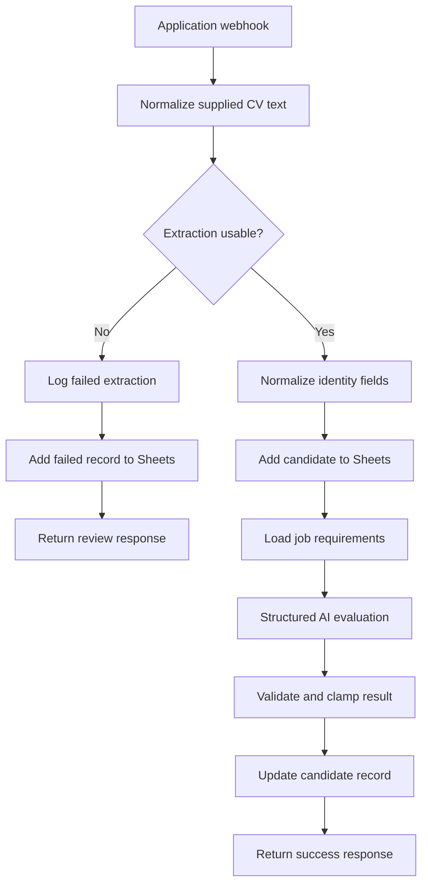

# CV Screening Automation — UK Recruitment


A **partial n8n portfolio implementation under repair** for first-pass candidate screening. The repository contains a 13-node workflow export, structured AI evaluation logic, Google Sheets persistence nodes, and explicit success/failure response paths, but the current workflow should **not** be treated as a working demo or production-ready hiring system.

**[Open the visual project page →](./index.html)**  
**[Historical walkthrough — not current verification →](https://youtu.be/3yUpuBxZmGA)**

## Current status

**Classification:** partial/broken implementation asset under repair.

The current export contains meaningful implementation evidence, but three defects prevent it from being presented as a verified working workflow:

1. **Extraction branch logic is reversed.** The current condition can route failed extraction into the screening path while valid extraction follows the failure path.
2. **Duplicate handling is placeholder logic.** Email normalization exists, but the duplicate check currently resolves `isDuplicate` to `false` rather than performing a real datastore lookup.
3. **Candidate state is not preserved correctly through the AI-output path.** The evaluation/update path can lose the original candidate context required for a reliable record update.

Until those issues are repaired and the workflow is rerun with representative test data, this repository is evidence of an implementation in progress—not evidence of a completed recruiter workflow.

## Evidence-backed scope

The included export contains **13 n8n nodes** and intended success/failure completion paths covering:

1. Webhook intake
2. Candidate-data normalization
3. Extraction quality check
4. Candidate record creation in Google Sheets
5. Job-requirement lookup
6. Structured OpenAI screening analysis
7. AI-output parsing and score validation
8. Candidate record update
9. Success response
10. Failure logging, failed-record creation, and error response

The workflow export contains no credential objects, API keys, personal candidate records, or private source documents. Google Sheet identifiers are placeholders.

## Intended architecture

> The diagram below describes the intended workflow design. It should not be read as proof that the current export executes this path correctly end to end.



## What is present in the export

| Capability | Current evidence / limitation |
|---|---|
| Candidate intake | POST webhook and dedicated response nodes are present |
| Candidate-data normalization | Code node structures form fields and supplied CV text |
| Extraction decision | Condition node is present, but its current branch behavior needs repair |
| Google Sheets persistence | Append/update nodes are present, but end-to-end state propagation must be repaired and verified |
| Requirement-based scoring | Explicit role requirements are passed to an OpenAI evaluation node |
| Structured AI output | JSON-oriented evaluation and score normalization logic are present |
| Duplicate handling | Email normalization exists; actual datastore duplicate lookup is still placeholder logic |
| Human review boundary | Real hiring use still requires a human review/approval gate |

## Required repair before reclassification

This project should only be reclassified as a working demo after all of the following are completed and evidenced:

- Repair the extraction condition and verify correct success/failure routing.
- Replace the placeholder duplicate check with a real lookup or remove the unsupported duplicate-detection claim.
- Preserve the original candidate state through AI evaluation and the final record update.
- Configure the workflow with representative test data and non-placeholder test resources.
- Run successful and failed-input cases and capture execution evidence.
- Verify that the correct candidate record is updated with the correct evaluation output.

## Important limitations

- This is **not currently a working demo** and is **not production-ready**.
- CV binary parsing is not included; the workflow expects supplied `cv_text` or an upstream parser.
- Google Sheets is demonstration-oriented storage and is not appropriate for sensitive candidate data at production scale without a broader security and governance design.
- A production implementation would also require stronger input validation, authentication, rate limiting, retention controls, audit logging, access control, and an explicit human decision boundary.

## Repository structure

```text
.
├── index.html
├── README.md
└── workflow/
    └── cv_screening_n8n_workflow.json
```

## Responsible use

AI screening should support—not replace—human judgment. Any real hiring implementation should be tested for bias and false negatives, use documented criteria, provide a review/appeal path, minimize stored personal data, and keep a human accountable for employment decisions.

## License

This project is available under the [MIT License](./LICENSE).

---

Designed and engineered by **Oyekola Ololade**  
AI Systems & Automation Engineer  
[oyekolaololade69@gmail.com](mailto:oyekolaololade69@gmail.com) · [LinkedIn](https://www.linkedin.com/in/ololade-oyekola-5b1797397/)
