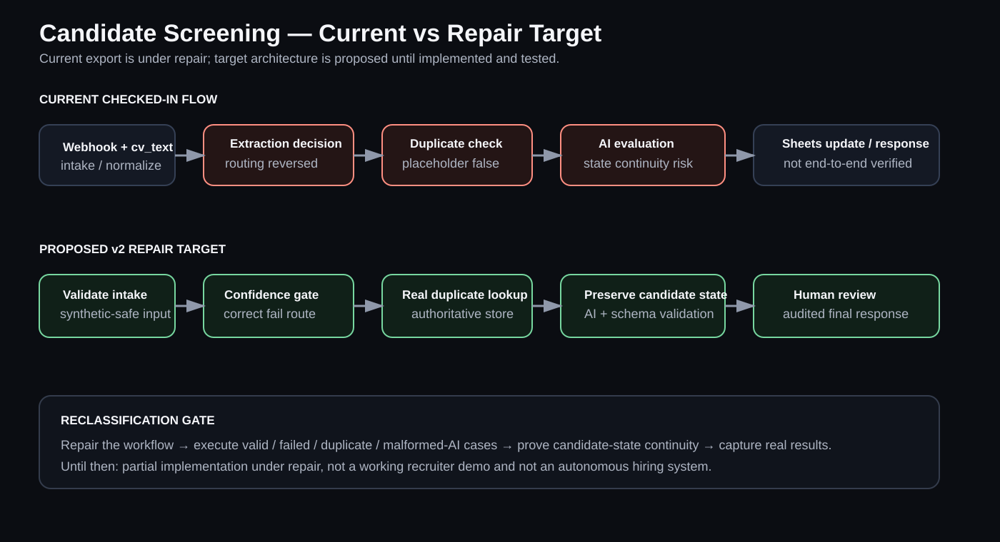
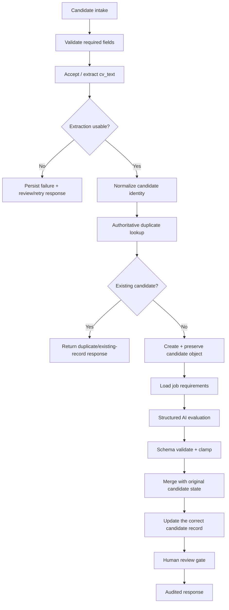

# CV Screening Automation — UK Recruitment


A **partial n8n portfolio implementation under repair** for first-pass candidate screening. The repository contains a 13-node workflow export, structured AI evaluation logic, Google Sheets persistence nodes, and explicit success/failure response paths, but the current workflow must **not** be treated as a working demo or production-ready hiring system.

**[Open the visual diagnostic page →](./index.html)**  
**[Historical walkthrough — not current verification →](https://youtu.be/3yUpuBxZmGA)**

<p align="center"></p>

## Table of contents

- [Current status](#current-status)
- [Version / generation history](#version--generation-history)
- [What the current export proves](#what-the-current-export-does-prove)
- [Intended repair architecture](#intended-repair-architecture)
- [Required repair before reclassification](#required-repair-before-reclassification)
- [Important limitations](#important-limitations)
- [Repository structure](#repository-structure)
- [Responsible use](#responsible-use)

### Generation / architecture quick links

| Generation | Status | README | Architecture |
|---|---|---|---|
| Historical demonstrated flow | Historical execution evidence | [open](versions/historical-demonstrated/README.md) | [reconstructed historical diagram](versions/historical-demonstrated/ARCHITECTURE.md) |
| Current checked-in flow | **Current · under repair** | [open](versions/current-under-repair/README.md) | [current diagnostic diagram](versions/current-under-repair/ARCHITECTURE.md) |
| v2 repair target | Proposed · not implemented | [open](versions/v2-proposed/README.md) | [proposed architecture](versions/v2-proposed/ARCHITECTURE.md) |

The historical diagram is explicitly reconstructed from the historical walkthrough/documentation because a standalone historical n8n screenshot was not recovered. The current and proposed diagrams remain separate so the repair target cannot be mistaken for current proof.

## Current status

**Classification:** partial/broken implementation asset under repair.

Three defects prevent the current export from being presented as a verified working workflow:

1. **Extraction branch logic is reversed.** Failed extraction can be routed into screening while valid extraction follows the failure path.
2. **Duplicate handling is placeholder logic.** Email normalization exists, but the duplicate decision resolves to false rather than performing an authoritative datastore lookup.
3. **Candidate state is not preserved reliably through the AI-output path.** The final update can lose the original candidate context/reference.

Until those issues are repaired and rerun with representative synthetic data, this repository is evidence of an implementation plus engineering diagnosis—not evidence of a completed recruiter workflow.

## Version / generation history

The repository separates three different truths:

1. **Historical demonstrated generation** — a prior screening flow was shown working in a walkthrough. That does not prove the current export.
2. **Current checked-in generation** — a real 13-node export with the defects documented above.
3. **Proposed v2 repair target** — a corrected architecture/specification that is not implemented yet.

Each generation has its own README and architecture page under [`versions/`](versions/).

## What the current export does prove

- POST webhook intake and dedicated response nodes exist.
- Candidate fields and supplied `cv_text` are normalized.
- Google Sheets append/update nodes exist.
- Role requirements are supplied to a structured AI-evaluation step.
- AI output parsing, score validation/clamping, and explicit success/failure response nodes exist.
- The public export contains no real candidate records or reusable production credentials.

## Intended repair architecture



**This is a repair target, not the current implementation.**

## Required repair before reclassification

- Fix extraction success/failure routing.
- Replace placeholder duplicate logic with an actual lookup or remove the duplicate claim.
- Preserve candidate identity/state through AI evaluation and final persistence.
- Configure representative synthetic test resources.
- Execute valid, failed-input, duplicate, malformed-AI-output, replay, and state-continuity cases.
- Capture actual execution evidence and write `TEST_RESULTS.md` only after those runs occur.

See:

- [v2 repair contract](docs/REPAIR_PLAN.md)
- [test plan](docs/TEST_PLAN.md)
- [security and responsible use](SECURITY.md)

## Important limitations

- **Not currently a working demo and not production-ready.**
- Binary PDF/image CV parsing is not included; the workflow expects supplied `cv_text` or an upstream parser.
- Google Sheets is demonstration-oriented storage and is not appropriate for sensitive candidate data at production scale without a wider security/governance design.
- Real hiring requires accountable human review, documented criteria, bias/error evaluation, access control, retention/deletion rules, audit logging, and an appeal/review path.

## Repository structure

```text
.
├── README.md
├── assets/
│   └── current-vs-target.svg
├── docs/
│   ├── REPAIR_PLAN.md
│   └── TEST_PLAN.md
├── versions/
│   ├── historical-demonstrated/
│   │   ├── README.md
│   │   └── ARCHITECTURE.md
│   ├── current-under-repair/
│   │   ├── README.md
│   │   └── ARCHITECTURE.md
│   └── v2-proposed/
│       ├── README.md
│       └── ARCHITECTURE.md
├── workflow/
│   └── cv_screening_n8n_workflow.json
├── evidence/current/
│   ├── demo/README.md
│   └── screenshots/README.md
├── index.html
├── SECURITY.md
├── LICENSE
└── CHANGELOG.md
```

## Responsible use

AI screening should support—not replace—human judgment. A real implementation should minimize stored personal data and keep a person accountable for employment decisions.

---

Designed and engineered by **Oyekola Ololade**  
AI Systems & Automation Engineer  
[oyekolaololade69@gmail.com](mailto:oyekolaololade69@gmail.com) · [LinkedIn](https://www.linkedin.com/in/ololade-oyekola-5b1797397/)
