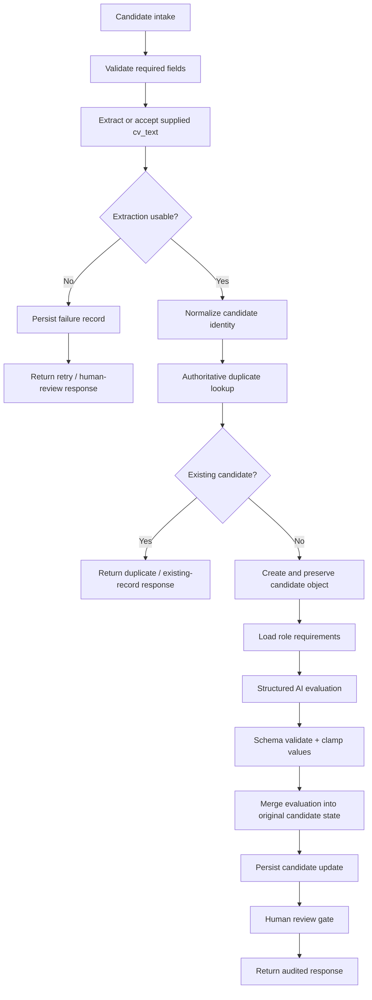

# Candidate Screening v2 Repair Plan

## Status

This document defines the repair target for the current 13-node n8n export. It is **not** proof that a repaired v2 workflow exists yet.

## Current blocking defects

1. **Extraction routing is reversed.** The current branch condition can route failed extraction into screening while valid extraction follows the failure path.
2. **Duplicate detection is placeholder logic.** Email normalization exists, but the workflow does not perform an authoritative datastore lookup before deciding whether the candidate already exists.
3. **Candidate state continuity is unreliable.** The original candidate object can be lost through the AI-output stage before the final record update.

## Required v2 flow

## Acceptance criteria

A repaired workflow must prove all of the following before the repository can be called a working demo:

- Valid extraction follows the screening route.
- Failed/insufficient extraction follows the failure route.
- Duplicate lookup reads an actual datastore and returns a deterministic result.
- A new candidate is created only after duplicate resolution.
- Original candidate identity/state remains available after AI evaluation.
- Structured AI output is parsed and validated before persistence.
- The correct candidate record receives the correct evaluation result.
- Success, failure, duplicate, and malformed-input responses are deterministic.
- Low-confidence or ambiguous cases remain reviewable by a person.
- No real candidate PII is required for tests.

## Minimum test matrix

| Test | Expected result |
|---|---|
| Valid candidate text | Candidate reaches evaluation and update path |
| Missing/weak CV text | Failure record + review/retry response |
| Existing normalized email | Duplicate response; no second candidate created |
| New normalized email | New candidate object created |
| AI returns malformed JSON | Validation failure; no incorrect update |
| AI returns out-of-range score | Score is rejected or clamped according to contract |
| Candidate state after AI | Original candidate ID/email still available |
| Final update | Correct row/record receives evaluation |
| Replayed request | No unintended duplicate side effect |

## Human-review boundary

AI output must support a recruiter rather than autonomously make a final employment decision. A production implementation would need explicit access control, retention limits, audit logging, bias/error evaluation, documented review criteria, and a review/appeal process.
