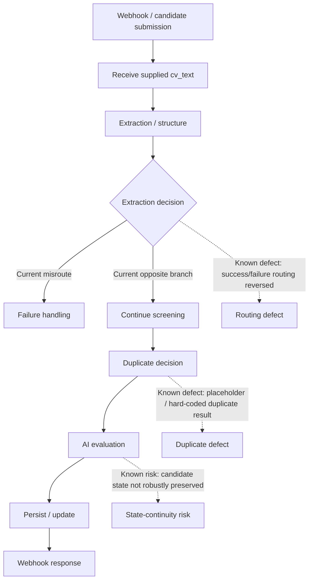

# Candidate Screening — Current Checked-In Architecture

> **Status:** CURRENT · UNDER REPAIR · diagnostic architecture, not a successful-runtime diagram.

## Current defects represented

1. **Extraction routing is reversed.**
2. **Duplicate detection is not authoritative.**
3. **Candidate state continuity is unreliable after AI evaluation.**
4. The workflow expects supplied `cv_text`; binary document extraction is not proven.

The repository-level `assets/current-vs-target.svg` and this page describe the same current defect boundary. Neither is runtime success evidence.
