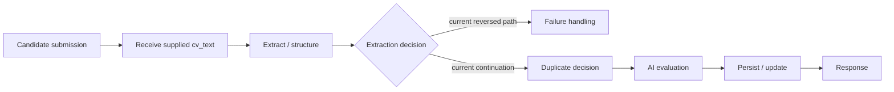

# Candidate Screening — Current Checked-In Generation

**Status:** CURRENT IMPLEMENTATION ARTIFACT · UNDER REPAIR · NOT BUYER-READY  
**Workflow authority:** `../../workflow/cv_screening_n8n_workflow.json`

## Current inspected structure

The current export contains a real 13-node screening flow with intake, supplied CV text handling, extraction/structuring, job-requirement lookup, AI-assisted evaluation, persistence/update and response components.

## Known defects

### 1. Extraction routing is reversed

The extraction decision routes successful/valid extraction toward failure handling while failed extraction can continue into screening. This breaks the intended control flow.

### 2. Duplicate detection is placeholder logic

The workflow does not perform an authoritative duplicate lookup. A hard-coded/placeholder false path means duplicate prevention cannot currently be claimed.

### 3. Candidate state continuity is unreliable

Candidate identity/state is not robustly preserved through the AI evaluation path into final persistence/update.

### 4. Input boundary

The checked-in generation expects supplied `cv_text`; robust binary PDF/image CV extraction is not established by this export.

## Current diagnostic architecture

## Current evidence

- `../../assets/current-vs-target.svg`
- `../../docs/REPAIR_PLAN.md`
- `../../docs/TEST_PLAN.md`
- `../../evidence/current/demo/README.md` — current demo placeholder until repaired current generation is genuinely rerun;
- `../../evidence/current/screenshots/README.md` — current screenshot placeholder/register.

## Claim boundary

Do not describe this generation as a working end-to-end recruiter automation. It is valuable as a real implementation + diagnosis/repair case study.

## Promotion gate

A repaired generation needs corrected routing, authoritative duplicate lookup, explicit candidate envelope/state continuity, structured output validation, human-review rules, security/data handling, branch tests, and new current screenshots/demo evidence.