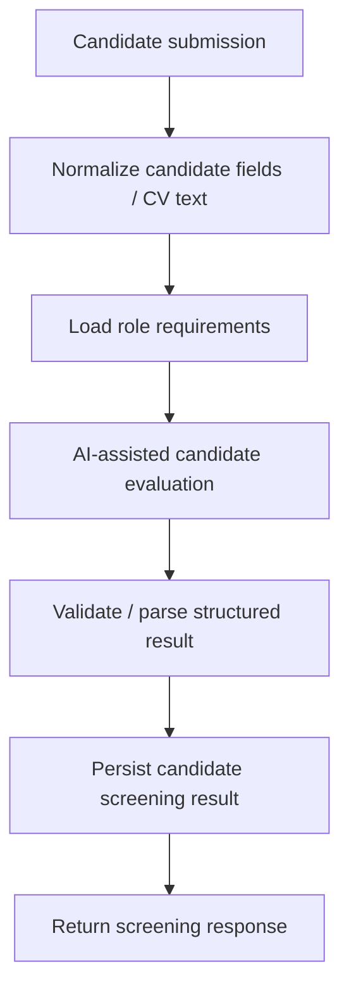

# Candidate Screening — Historical Demonstrated Architecture

> **Status:** RECONSTRUCTED HISTORICAL ARCHITECTURE FROM WALKTHROUGH/DOCUMENTATION · not the current checked-in graph.

## Provenance

The historical walkthrough supports that an earlier generation functioned as a candidate-screening workflow. The exact historical node graph was not recovered as a standalone current archive asset, so this diagram is a **reconstructed architecture envelope**, not a recovered n8n screenshot.

## What it proves

- the historical generation had an intake → requirements → evaluation → persistence/response screening shape;
- a historical working demonstration existed.

## What it does not prove

- that the current 13-node export has the same routing;
- that historical duplicate/state logic matches the current export;
- production security, fairness, governance or reliability.
