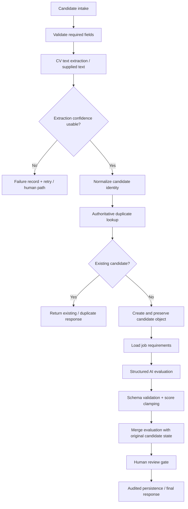

# Candidate Screening v2.0 — Proposed Repair Architecture

> **Status:** PROPOSED REPAIR TARGET · not implemented.

## Design intent

The proposed v2 repair corrects the current branch inversion, replaces placeholder duplicate logic with an authoritative lookup, preserves a stable candidate envelope through AI evaluation, and introduces an explicit human-review/audit boundary.

This page is architecture **design evidence only**. It must not be described as implemented until a v2 workflow export and representative execution evidence exist.
