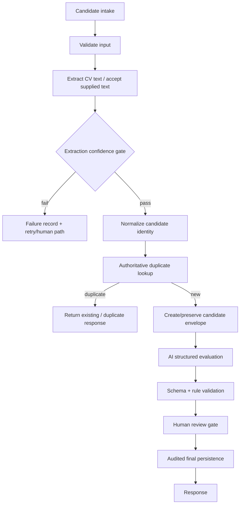

# Candidate Screening v2 — Proposed Repair Target

**Status:** PROPOSED / REPAIR TARGET — NOT CURRENT IMPLEMENTATION  
**Future artifact name:** `Candidate_Screening_n8n_Workflow_v2.0_Repaired_<date>.json`

## Target architecture

## Required data contract

A v2 candidate envelope should keep stable identity/state fields across every step, including candidate ID, source, normalized identity/contact data, job/requisition reference, extraction result/confidence, duplicate lookup result, evaluation payload, review state, final decision and audit metadata.

## Required controls

- duplicate detection must query authoritative state;
- extraction success/failure routing must be correct;
- AI output must be schema-validated before deterministic use;
- state must remain continuous across AI/tool boundaries;
- uncertain/high-impact outcomes must be reviewable;
- failure paths must preserve enough context for diagnosis/retry;
- PII/retention/access rules must be explicit.

## Required verification

1. valid supplied-text candidate;
2. failed/low-confidence extraction;
3. duplicate candidate;
4. new candidate;
5. malformed AI output;
6. persistence failure;
7. human-review approve/reject/request-more-info paths;
8. replay/idempotency behavior where applicable;
9. sanitized current screenshots;
10. a new demo recorded only after the repaired workflow actually passes.

## Media policy

This is a future/proposed target, not an old version and not the current implementation. Do not place fake execution screenshots or demo media here. When v2 is actually implemented, create a new implemented-version folder and current evidence from real runs.